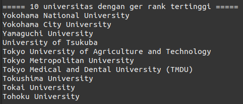

# Modul 1

## Anggota:

- Irsyad Fikriansyah Ramadhan (5025211149)
- Ligar Arsa Arnata (5025211244)
- Radhiyan Muhammad Hisan (5025211166)

## Penjelasan

### soal1
#### a. 5 universitas teratas di Jepang

1. Dari file yang telah ditentukan...
2. Ambil baris yang memiliki kata "Japan"
3. Pisah menjadi kolom dengan pemisah "," (koma)
4. Ambil hanya kolom 1 (peringkat) dan 2 (nama)
5. Karena rank sudah berurutan, ambil 5 baris teratas
6. Tampilkan namanya saja

#### b. Universitas dengan fsr score terendah dari 5 universitas teratas di Jepang

1. Lakukan seperti sub-soal a sampai langkah ke 5, namun yang diambil bukan kolom 1 (peringkat) melainkan kolom 9 (fsr score)
2. Dengan pemisah "," (koma), urutkan berdasarkan kolom 2 (fsr score) secara numerik (hasilnya kecil-besar)
3. Ambil 1 baris teratas
4. Tampilkan namanya saja

#### c. 10 universitas dengan ger rank tertinggi

1. Lakukan seperti langkah 1 sub-soal b, namun yang diambil bukan kolom 9 (fsr score) melainkan kolom 20 (ger rank)
2. Dengan pemisah "," (koma), urutkan berdasarkan kolom 2 (fsr score) secara numerik dan dibalik (hasilnya besar-kecil)
3. Ambil 10 baris teratas
4. Tampilkan namanya saja
5. Karena banyak yang memiliki skor sama, hasilnya diurutkan lagi dengan namanya

#### d. Universitas keren di dunia

1. Dari file yang telah ditentukan...
2. Cari baris yang memiliki kata "Keren"
3. Tampilkan kolom 2 (nama)

### soal2
#### a. Download()
1. Mengambil jam (hour) sebagai jumlah gambar yang akan di-download
2. Dilakukan pengecekan pada jam:
   <ol type="a">
        <li> Jika jam menunjukkan "00", maka akan diganti menjadi "1" </li>
        <li> Jika jam memiliki awalan "0" (contoh: "09"), maka akan dihapus awalannya </li>
   </ol>
3. Menyimpan jumlah folder bernama "kumpulan_*" sebagai tempat gambar yang akan di-download
4. Membuat direktorinya sesuai dengan penamaan folder keberapa
5. Menyimpan html website kedalam variable "html" menggunakan command curl
6. Mengekstrak hanya link gambar yang terdapat pada html yang telah dikumpulkan menggunakan command grep
7. Setelah dapat link gambar, kemudian dilakukan loop sebanyak jam untuk dilakukan mengunduh gambar
7. Setiap pengunduhan, penamaan gambar akan di-increment dan akan disimpan kedalam folder yang telah dibuat sebelumnya

#### b. Zip()
1. Mencari semua zip "demon_*" pada direktori untuk mendapatkan jumlahnya yang nantinya akan menentukan penamaan zip
2. Mencari semua folder "kumpulan_*" pada direktori yang nantinya akan di zip
3. Jika tidak ditemukan folder "kumpulan_*", maka tidak ada yang perlu dilakukan zip, sehingga dapat keluar (exit 1)
4. Menyimpan semua folder "kumpulan_*" yang akan di-zip dalam sebuah variabel
5. Dilakukan zipping

untuk memenuhi ketentuan download setiap 10 jam dan zip sehari sekali, maka perlu dilakukan cron job, berikut adalah step-step untuk setting cron job:
```
$ crontab -e
0 */10 * * * '{direktori}/kobeni_liburan.sh' Download
59 23 * * * '{direktori}/kobeni_liburan.sh' Zip
```

### soal3
#### a. louis.sh
1. Ambil input username dari user
2. Pindahkan username ke users.txt
3. Cek apakah username pernah dipakai atau tidak
   <ol type="a">
        <li> Jika pernah maka print “Register Invalid” dan kirimkan infonya ke log.txt </li>
        <li> Jika belum maka lanjut ke langkah berikutnya </li>
   </ol>
4. Ambil input password dari user
5. Melakukan pengecekkan ketentuan password
6. Buat fungsi “invalid_pass” yang akan mengelurakan info password belum tepat
    <ol type="a">
        <li> Cek apakah password sudah memiliki panjang 8 karakter, jika belum panggil fungsi “invalid_pass”</li>
        <li> Cek apakah password sudah memiliki huruf kecil, jika belum panggil fungsi “invalid_pass”</li>
        <li> Cek apakah password sudah memiliki huruf besar, jika belum panggil fungsi “invalid_pass”</li>
        <li> Cek apakah password sudah memiliki angka, jika belum panggil fungsi “invalid_pass”</li>
        <li> Cek apakah password memiliki kata “chicken”, jika iya panggil fungsi “invalid_pass”</li>
        <li> Cek apakah password sudah memiliki kata “ernie”, jika iya panggil fungsi “invalid_pass”</li>
        <li> Cek apakah password sama dengan username, jika iya panggil fungsi “invalid_pass”</li>
    </ol>
7. Jika sudah sesuai ketentuan print “Password Valid”, dan pindahkan username beserta password ke users.txt
8. Jika sudah dipindahkan, kirim info bahwa ada user yang baru melakukan register ke log.txt

#### b. retep.sh
1. Ambil input username dari user
2. Cek apakah username ada di users.txt atau tidak
3. Ambil input password dari user
4. Buat variabel bernama “Stored_password” untuk mengambil informasi password dari users.txt
    <ol type="a">
        <li> Jika password yang diinputkan user sesuai dengan “Stored_password”, maka kirimkan informasi login berhasil ke log.txt </li>
        <li> Jika password yang diinputkan user berbeda dengan “Stored_password”, maka kirimkan informasi login gagal ke log.txt </li>
    </ol>


### soal4
#### a. log_encrypt.sh
1. Menyimpan date sebagai penamaan log yang akan disimpan
2. Mengambil jam pada date yang telah disimpan sebagai key enkripsi
3. Menyimpan syslog yang berada pada `/var/log/syslog` kedalam sebuah variable
4. Dilakukan iterasi sebanyak panjang dari syslog dan setiap iterasi dilakukan caesar cipher
5. Hasil dari enkripsi kemudian disimpan kedalam file (date).txt

#### b. log_decrypt.sh
1. User akan diminta menginputkan nama log yang akan didekripsi
2. Mencari file yang telah diinputkan
3. Bila ditemukan, ambil jam pada nama file yang telah diinput
4. Dilakukan iterasi sebanyak panjang dari syslog dan setiap iterasi dilakukan caesar cipher secara terbalik

untuk memenuhi ketentuan backup file syslog setiap 2 jam, maka perlu dilakukan cron job, berikut adalah step-step untuk setting cron job:
```
$ crontab -e
0 */2 * * * {directory}/log_encrypt.sh
```